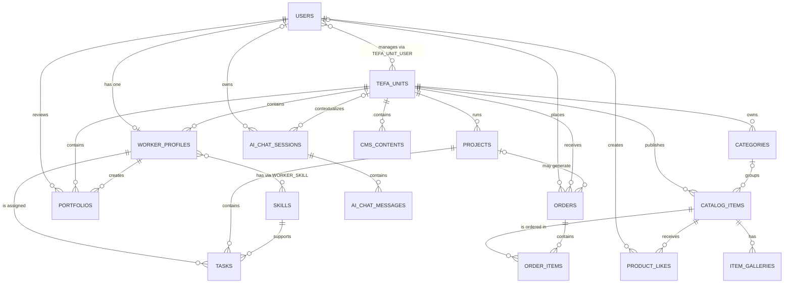

# Entity Relationship Diagram

ERD ini menggambarkan schema domain aktif setelah model orphan dibersihkan. Tabel
internal Laravel seperti `cache`, `jobs`, dan `migrations` tidak ditampilkan.

## Cardinality Notes

| Relationship | Cardinality | Meaning |
| --- | --- | --- |
| `users` - `worker_profiles` | `1 : 0..1` | User boleh belum memiliki profile pekerja; satu profile hanya milik satu user. |
| `tefa_units` - `worker_profiles` | `1 : 0..N` | Satu unit memiliki banyak pekerja; satu pekerja berada pada satu unit. |
| `users` - `tefa_units` | `0..N : 0..N` | Admin dan unit terhubung melalui `tefa_unit_user`. |
| `worker_profiles` - `skills` | `0..N : 0..N` | Relasi many-to-many melalui `worker_skill`, dengan `proficiency_level`. |
| `tefa_units` - `catalog_items` | `1 : 0..N` | Item katalog wajib memiliki satu unit TEFA. |
| `categories` - `catalog_items` | `1 : 0..N` | Item boleh tidak memiliki kategori karena `category_id` nullable. |
| `catalog_items` - `item_galleries` | `1 : 0..N` | Satu item dapat memiliki banyak gambar. |
| `users` - `orders` | `1 : 0..N` | Order dapat berasal dari guest karena `orders.user_id` nullable. |
| `orders` - `order_items` | `1 : 0..N` | Satu order terdiri dari detail item. |
| `projects` - `tasks` | `1 : 0..N` | Satu project dapat memiliki banyak task. |
| `worker_profiles` - `tasks` | `1 : 0..N` | Worker dapat memiliki banyak task; penugasan worker bersifat opsional. |
| `ai_chat_sessions` - `ai_chat_messages` | `1 : 0..N` | Satu sesi chat memiliki banyak pesan. |

## Important Design Point

`tefa_unit_id` pada `worker_profiles` adalah penentu bidang/unit TEFA pekerja.
`skills` hanya menyimpan keahlian pekerja, bukan unit atau bidang TEFA.